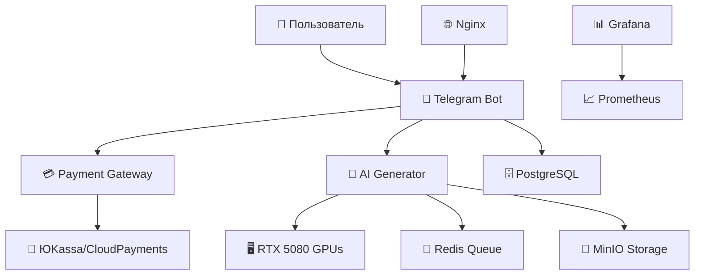

# 🤖 Telegram AI Bot с Банковским Эквайрингом

[](https://python.org)
[](https://docker.com)
[](https://nvidia.com)
[](https://yookassa.ru)
[](https://nalog.ru)

Production-ready Telegram бот для генерации AI изображений с полной интеграцией российских платежных систем и оптимизацией для RTX 5080.


## ✨ Ключевые особенности

🎨 **AI Генерация на RTX 5080**
- Stable Diffusion XL с оптимизацией Blackwell
- Multi-GPU балансировка до 3 карт
- Время генерации: 5-60 секунд
- Качества: Fast, Standard, High, Ultra

💳 **Российские Платежные Системы**
- ЮKassa (карты, СБП, SberPay, ЮMoney)
- CloudPayments (Visa/MC/МИР)
- Автоматическая фискализация (54-ФЗ)
- PCI DSS compliance

⚡ **Production-Ready Архитектура**
- Микросервисы на Docker
- PostgreSQL + Redis + MinIO
- Nginx с SSL терминацией
- Prometheus + Grafana мониторинг

🇷🇺 **Соответствие Законодательству**
- 54-ФЗ: Автоматические чеки через ОФД
- 152-ФЗ: Согласие на обработку данных
- Валютное право: Только рублевые платежи

## 🚀 Быстрый старт

### 1. Системные требования

- **ОС**: Ubuntu 22.04+ / Debian 11+ / CentOS 8+
- **GPU**: RTX 5080 (рекомендуется) или RTX 4090/4080
- **RAM**: 32GB+ (рекомендуется 64GB)
- **Диск**: 1TB+ SSD (для моделей и данных)
- **CPU**: 16+ cores (Intel/AMD)

### 2. Установка

```bash
# Клонирование репозитория
git clone https://github.com/your-username/telegram-ai-bot.git
cd telegram-ai-bot

# Настройка системы (Ubuntu/Debian)
sudo apt update && sudo apt upgrade -y
sudo apt install docker.io docker-compose nvidia-driver-570 cuda-toolkit-12-8

# Настройка RTX 5080
sudo chmod +x scripts/setup_rtx5080.sh
./scripts/setup_rtx5080.sh

# Конфигурация
cp .env.example .env
nano .env  # Настройте переменные окружения

# Создание SSL сертификатов
chmod +x scripts/init_ssl.sh
./scripts/init_ssl.sh yourdomain.com

# Деплой в production
chmod +x scripts/deploy.sh
./scripts/deploy.sh production
```

### 3. Конфигурация .env

```bash
# Telegram Bot (от @BotFather)
BOT_TOKEN=1234567890:your_bot_token_here
BOT_WEBHOOK_URL=https://yourdomain.com

# ЮKassa (из личного кабинета)
YOOKASSA_SHOP_ID=your_shop_id
YOOKASSA_SECRET_KEY=your_secret_key

# Безопасность (генерируйте случайные!)
DB_PASSWORD=your_secure_db_password_123
REDIS_PASSWORD=your_redis_password_456
SECRET_KEY=your_jwt_secret_key_789

# Компания (для 54-ФЗ)
COMPANY_INN=1234567890
COMPANY_NAME="ООО Ваша IT Компания"
COMPANY_EMAIL="support@yourcompany.ru"
```

## 💰 Тарифные планы

| Пакет | Цена | Изображения | Качество | Размер | Особенности |
|-------|------|-------------|----------|--------|-------------|
| 💎 Разовая | 49₽ | 1 | Standard | 512×512 | Обычная очередь |
| 📦 Базовый | 299₽ | 10 | Standard | 512×512 | 30 дней действия |
| ⭐ Премиум | 599₽ | 25 | High | 768×768 | Приоритет + 60 дней |
| 🔥 Профи | 1299₽ | 60 | Ultra | 1024×1024 | Без очереди + 90 дней |

## 📊 Мониторинг

После запуска доступны интерфейсы:
- **Grafana**: http://localhost:3000 (admin/пароль_из_.env)
- **Prometheus**: http://localhost:9090
- **MinIO Console**: http://localhost:9001

## 🛠️ Управление

```bash
# Просмотр статуса
docker-compose -f docker-compose.prod.yml ps

# Логи всех сервисов
docker-compose -f docker-compose.prod.yml logs -f

# Логи конкретного сервиса
docker logs -f telegram_bot_prod

# Создание бекапа
./scripts/backup.sh --with-images

# Обновление проекта
git pull && ./scripts/deploy.sh production

# Остановка
docker-compose -f docker-compose.prod.yml down
```

## Тестирование

1. Локальный запуск в режиме разработки
Это первый и самый важный шаг, чтобы убедиться, что все сервисы в принципе запускаются и связываются друг с другом.

Создайте .env: Скопируйте 
.env.example
 в .env и заполните его тестовыми данными. Вам не нужны реальные ключи API, можно использовать любые строки.
Сгенерируйте SSL-сертификаты: Выполните команду bash scripts/init_ssl.sh.
Запустите проект: Выполните команду bash scripts/deploy.sh development. Эта команда использует 
docker-compose.yml
 и запустит все сервисы.
Проверьте логи: Убедитесь, что все контейнеры запустились без ошибок, выполнив docker-compose logs -f.
2. Тестирование основного функционала бота
После успешного запуска можно тестировать логику самого бота.

Команда /start: Отправьте боту команду /start. Вы должны получить приветственное сообщение с вашим балансом и списком тарифов.
Покупка тарифа:
Нажмите на кнопку "Купить изображения".
Выберите любой тариф.
Выберите способ оплаты. Вы должны получить ссылку на оплату.
Важно: Так как ключи тестовые, реальной оплаты не произойдет. Чтобы имитировать успешный платеж, вам нужно будет вручную изменить статус платежа в базе данных или использовать тестовые вебхуки от ЮKassa/CloudPayments, если они предоставляют такую возможность.
Генерация изображения:
Нажмите "Генерировать изображение".
Следуйте инструкциям: введите промпт, выберите стиль и качество.
Вы должны получить сообщение "Ваш запрос принят!".
Через некоторое время (в зависимости от нагрузки) бот должен прислать вам сгенерированное изображение.
Команды /history и /support: Проверьте, что обе команды возвращают корректную информацию.
3. Тестирование через docker exec
Для более глубокой проверки можно подключаться к контейнерам и выполнять команды внутри них.

Проверка очереди Celery:
Выполните docker exec -it celery_worker bash.
Внутри контейнера можно запустить celery -A src.shared.celery_app status, чтобы проверить статус воркера.
Проверка базы данных:
Выполните docker exec -it telegram_bot_db psql -U bot_user -d telegram_bot.
Внутри psql вы можете выполнять SQL-запросы, например, SELECT * FROM users; или SELECT * FROM tariffs;, чтобы проверить, как сохраняются данные.
Что делать, если что-то пойдет не так?
Смотрите логи: docker-compose logs -f [имя_сервиса] — ваш лучший друг. Ищите сообщения об ошибках (ERROR или Exception).
Проверяйте конфигурацию: Убедитесь, что все переменные в .env файле установлены правильно.

## 🔧 Архитектура



### Компоненты системы:
- **Telegram Bot**: Обработка команд и интерфейс пользователя
- **AI Generator**: Генерация изображений на RTX 5080
- **Payment Gateway**: Обработка платежей и webhook
- **Database**: PostgreSQL для пользователей и транзакций
- **Queue System**: Redis для очередей генерации
- **File Storage**: MinIO для изображений
- **Monitoring**: Prometheus + Grafana для метрик

## 💡 Примеры использования

### Генерация изображений
```
🎨 /generate
📝 "Красивый закат над морем в стиле импрессионизма"
⏳ Генерация... (15-45 секунд)
✅ Готово! Изображение 1024×1024
```

### Покупка пакета
```
💳 /buy
📦 Выбор пакета → Оплата картой/СБП
✅ Автоматическое пополнение баланса
🧾 Фискальный чек на email
```

## 🎯 Performance

### RTX 5080 Benchmarks
- **Fast качество**: 5-8 секунд (8 шагов)
- **Standard качество**: 15-25 секунд (20 шагов)
- **High качество**: 35-60 секунд (35 шагов)
- **Ultra качество**: 45-80 секунд (50 шагов)

### Пропускная способность
- **До 1000 пользователей** одновременно
- **~200 изображений/час** на RTX 5080
- **99.9% uptime** с автоперезапуском

## 🔐 Безопасность

✅ **Платежная безопасность**
- PCI DSS Level 1 compliance
- Токенизация карт
- 3DS аутентификация
- Шифрование AES-256

✅ **Системная безопасность**
- SSL/TLS для всего трафика
- JWT токены для авторизации
- Rate limiting и DDoS защита
- Автоматические бекапы

✅ **Законодательство РФ**
- Фискализация через ОФД
- Хранение данных в России
- Согласие на обработку ПДн
- Налоговая отчетность

## 📈 Экономика проекта

### Примерная доходность:
- **100 активных пользователей/день**: ~15,000₽/месяц
- **500 активных пользователей/день**: ~75,000₽/месяц
- **1000 активных пользователей/день**: ~150,000₽/месяц

### Операционные расходы:
- **Сервер**: 15,000-30,000₽/месяц
- **Эквайринг**: 2.8-3.5% с оборота
- **ОФД**: 3,000₽/год
- **Домен/SSL**: 2,000₽/год

## 🤝 Поддержка

### Техническая поддержка
- 📧 Email: support@yourcompany.ru
- 💬 Telegram: @your_support_bot
- 🐛 GitHub Issues
- 📚 Wiki документация

### Разработка
1. Fork репозитория
2. Создайте feature branch
3. Внесите изменения с тестами
4. Создайте Pull Request

## 📄 Лицензия

MIT License - см. [LICENSE](LICENSE)

## ⭐ Поддержите проект

Если проект оказался полезным:
- Поставьте ⭐ на GitHub
- Поделитесь с коллегами
- Создайте Issue с предложениями
- Внесите вклад в код

---

**🚀 Готовый к production Telegram AI бот с банковским эквайрингом и RTX 5080 оптимизацией!**
